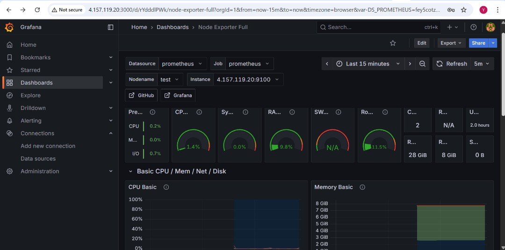
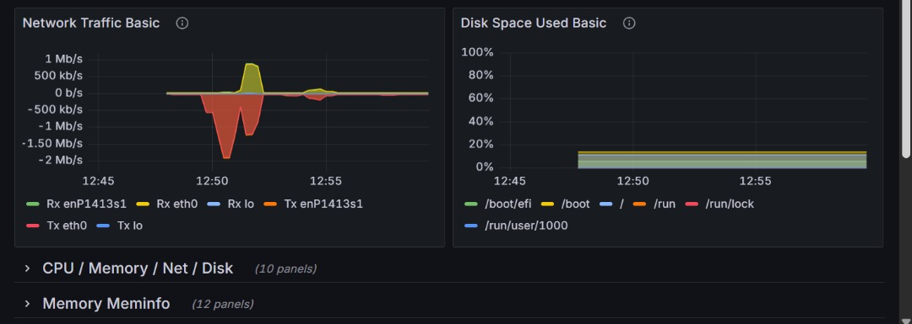

# Prometheus-Grafana-Loki
Prometheus and Grafana have become industry standards for monitoring and visualization due to their flexibility, scalability, and powerful features. These tools effectively allows you to monitor and troubleshoot complex systems.

## What is monitoring

Monitoring is collecting and visualising data about systems regurlarly so that health system can be viewed and tracked, Three main questions monitoring answered are:

- is the service on?
- is the service functioning as expected?
- is the service performing well?

## What is observability

Monitoring is part of observability, to use monitoring, we need to know what to monitor in advance with **obeservability** we can anticipate problems we havent think of yet, it tells us further where, when and why an issue occurs:

- A very deatiled of events?
### The above directories shows how to install, configure and integrate prometheus with grafana , Dashboard Design, setting alerting rules and Notification points

## Node exporter Dashboard

Node Exporter gives infrastructure-level metrics (CPU, memory, disks, network) to help Prometheus and Grafana monitor server health example of some promql

- 100 - (avg by (instance) (rate(node_cpu_seconds_total{mode="idle"}[5m])) * 100)
- node_memory_MemTotal_bytes - node_memory_MemAvailable_bytes
- sum by (instance) (rate(node_network_receive_bytes_total{device!="lo"}[5m]))

  #### Node exporter Dashboard below

  

  

